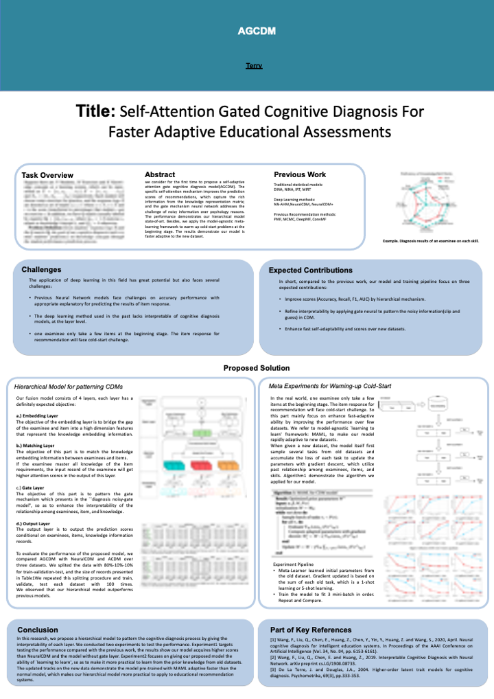

# Introduction For AGCDM 
#### Code implementation of Attention Gate Mechnism for Cognitive Diagnosis.


### 1. Brief Introduction
This repository contains AGCDM (Attention Gate Mechnism for Cognitive Diagnosis) based code recommendation models implemented by PyTorch on the Linux, which can generate item response predictions for skills proficiency on latent ability level.

## Poster

<p align="center">
        </a>
</p>


> How to run?
* 1. Deploy our files on Colab or Linux. Download and Drag the three dataset in the Dataset Files.

* 2. Replace the path to your own path of files.

* 3. Upzip the dataset file to the ./content.

* 4. Run each cells of code,  and modify the hyperparameters in the Arguments Class.
```
class Arguments():
    def __init__(self):
        self.epochs = 100
        self.batch_size = 256
        self.embedding_size = 768
        self.test_batch_size = 256
        self.lr = 1e-3
        self.momentum = 0.5
        self.no_cuda = False
        self.seed = 42
        self.log_interval = 10
        self.valid_freq = 1
        self.save_model = False
        self.model = 'ours'
        self.save_path = path+'results/'
        self.resume = False
        self.check_point_path = path+'results/model/'
        self.resume = False
args = Arguments()
```
, or modify the hyperparameters if you run the bash file of script/run.sh
```
--train_data_file=dataset/<data_name>
--output_dir=./results/logs/<data_name>.log  
--meta=True
--do_train 
--do_test
```
The setup of each hyperparameters will get different outputs in our experiments via runining file:
```bash
cd script
bash run.sh GPU_IDS
```

### 2. Project Structure
There are one Demo for Run and several experiment records inside the project:

1. Demo
 
- **torch_version**

  A implemented AGCDM model based on the Pytorch. All the input data refers to the README.md in **Dataset files**.

2. Experiment1
- **torch_version**
  Comparison of our model with previous models,
  which an implementation of item response recommendation model for our submitted paper.
    The files are named with **Experiment1_Dataset** in the experiments file.

3. Experiment2
- **torch_version**
  Comparison of models deployed on the meta with the normal models, and test their performance on the learning track. The files are named with **coldStart_dataset_K_shot** in the experiments file.
  

### Dataset For Cognitive Science

#### 1. FrcSub
FrcSub is a public dataset for measuring student's skills proficiency on the examinee.
The file comprimise of item response log and knowledge point matrix labeled by professional experts.

The knowledge point matrix examinee the following 8 skills:
* 1	Convert a whole number to a fraction,

* 2	Separate a whole number from a fraction,

* 3	Simplify before subtracting,

* 4	Find a common denominator,

* 5	Borrow from whole number part,

* 6	Column borrow to subtract the second numerator from the first,

* 7	Subtract numerators,

* 8	Reduce answers to simplest form.

Each item-skills record was stored in the Q.txt file.

The reference: [<sup>1</sup>](#refer-anchor1). 

#### 2. Math1
The data structure is the same to the public FrcSub. The knowledge point matrix examinee the following 11 skills:

* 1	Set,
* 2	Inequality,
* 3	Trigonometric function,
* 4	Logarithm versus exponential,
* 5	Plane vector,
* 6	Property of function,
* 7	Image of function,
* 8	Spatial imagination,
* 9	Abstract summarization,
* 10	Reasoning and demonstration,
* 11	Calculation.

The reference: [<sup>2</sup>](#refer-anchor2).
Download Link: [Math2015](http://staff.ustc.edu.cn/%7Eqiliuql/data/math2015.rar.).

#### 3. Math2
The data structure is the same to the public FrcSub. The knowledge point matrix examinee the following 16 skills:
* 1	Property of inequality,
* 2	Methods of data sampling,
* 3	Geometric progression,
* 4	Function versus equation,
* 5	Solving triangle,
* 6	Principles of data analysis,
* 7	Classical probability theory,
* 8	Linear programming,
* 9	Definitions of algorithm,
* 10	Algorithm logic,
* 11	Arithmetic progression,
* 12	Spatial imagination,
* 13	Abstract summarization,
* 14	Reasoning and demonstration,
* 15	Calculation,
* 16	Data handling.

#### 4. ASSISment

The reference: [<sup>2</sup>](#refer-anchor2).
Download Link: [ASSISment](https://sites.google.com/site/assistmentsdata/datasets).


### 3. AGCDM's performances on the educational datasets:
| Model                                          |                 FrcSub                |                                       |              ASSISTments              |                                       |                 Math1                 |                                       |                 Math2                 |                                       |
|------------------------------------------------|:-------------------------------------:|:-------------------------------------:|:-------------------------------------:|:-------------------------------------:|:-------------------------------------:|:-------------------------------------:|:-------------------------------------:|:-------------------------------------:|
|                                              |     Precision    |        F1        |     Precision    |        F1        |     Precision    |        F1        |     Precision    |        F1        |
| AGCDM                                 | 83.9\% $\pm$ 0.53\% | $85.9\% \pm 0.31\%$ | $75.2\% \pm 0.83\%$ | $75.9\% \pm 0.48\%$ | $74.8\% \pm 0.23\%$ | $72.3\% \pm 0.41\%$ | $73.3\% \pm 0.16\%$ | $69.3\% \pm 0.28\%$ |
| $\uparrow$   $\uparrow$ |            +2.2\%            |            +2.5\%            |            +1.6\%            |            +1.8\%            |            +1.2\%            |            +2.2\%            |            +1.5\%            |            +4.6\%            |


### 4. Reference
<div id="refer-anchor1"></div>

[1] [Analysis of Errors in Fraction Addition and Subtraction Problems.](https://eric.ed.gov/?id=ED257665)

<div id="refer-anchor2"></div>

[2] [Cognitive modelling for predicting examinee performance](https://www.aaai.org/ocs/index.php/IJCAI/IJCAI15/paper/viewPaper/11121)


<div id="refer-anchor1"></div>

[3] [Github: Neural_Cognitive_Diagnosis-NeuralCD](https://github.com/bigdata-ustc/Neural_Cognitive_Diagnosis-NeuralCD)

<div id="refer-anchor2"></div>

[4] [GitHub - Pytorch](https://github.com/pytorch/pytorch)


## Appendix

Structure of Code Files
```
📦AGCDM
 ┣ 📂config
 ┃ ┣ 📜.DS_Store
 ┃ ┣ 📜DinaByEm.py
 ┃ ┣ 📜backbone.yml
 ┃ ┗ 📜dina.py
 ┣ 📂dataset
 ┃ ┣ 📂FrcSub
 ┃ ┃ ┣ 📜data.txt
 ┃ ┃ ┣ 📜problemdesc.txt
 ┃ ┃ ┣ 📜q.txt
 ┃ ┃ ┗ 📜qnames.txt
 ┃ ┣ 📜.DS_Store
 ┃ ┗ 📜README.md
 ┣ 📂experiments
 ┃ ┣ 📜.DS_Store
 ┃ ┣ 📜coldstart_frbsub_1shot.py
 ┃ ┣ 📜coldstart_frbsub_5shot.py
 ┃ ┣ 📜coldstart_math1_1shot.py
 ┃ ┣ 📜coldstart_math1_5shot.py
 ┃ ┣ 📜coldstart_math2_1shot.py
 ┃ ┣ 📜coldstart_math2_5shot.py
 ┃ ┣ 📜experiment1.py
 ┃ ┣ 📜experiment2.py
 ┃ ┗ 📜experiment3.py
 ┣ 📂models
 ┃ ┣ 📜.DS_Store
 ┃ ┗ 📜model
 ┣ 📂results
 ┃ ┣ 📂figs
 ┃ ┃ ┣ 📜FrcSub_auc_1shot.png
 ┃ ┃ ┣ 📜FrcSub_auc_5shot.png
 ┃ ┃ ┣ 📜FrcSub_rmse_1shot.png
 ┃ ┃ ┣ 📜FrcSub_rmse_5shot.png
 ┃ ┃ ┣ 📜Math1_auc_1shot.png
 ┃ ┃ ┣ 📜Math1_auc_5shot.png
 ┃ ┃ ┣ 📜Math1_rmse_1shot.png
 ┃ ┃ ┣ 📜Math1_rmse_5shot.png
 ┃ ┃ ┣ 📜Math2_auc_1shot.png
 ┃ ┃ ┣ 📜Math2_auc_5shot.png
 ┃ ┃ ┣ 📜Math2_rmse_1shot.png
 ┃ ┃ ┣ 📜Math2_rmse_5shot.png
 ┃ ┃ ┣ 📜Q.png
 ┃ ┃ ┣ 📜attention.png
 ┃ ┃ ┣ 📜case1.png
 ┃ ┃ ┣ 📜case1_skill.png
 ┃ ┃ ┣ 📜colorbar.png
 ┃ ┃ ┣ 📜experiment2_rmse_FrcSub.png
 ┃ ┃ ┗ 📜poster.png
 ┃ ┣ 📂logs
 ┃ ┃ ┗ 📜.DS_Store
 ┃ ┣ 📂scores
 ┃ ┃ ┣ 📜Experiment2_FrcSub.pt
 ┃ ┃ ┣ 📜Experiment2_Math1.pt
 ┃ ┃ ┗ 📜Experiment2_Math2.pt
 ┃ ┗ 📜.DS_Store
 ┣ 📂script
 ┃ ┣ 📜.DS_Store
 ┃ ┗ 📜run.sh
 ┣ 📂utils
 ┃ ┣ 📜.DS_Store
 ┃ ┗ 📜utils.py
 ┣ 📜.DS_Store
 ┣ 📜LICENSE
 ┣ 📜README.md
 ┗ 📜run.py
```

